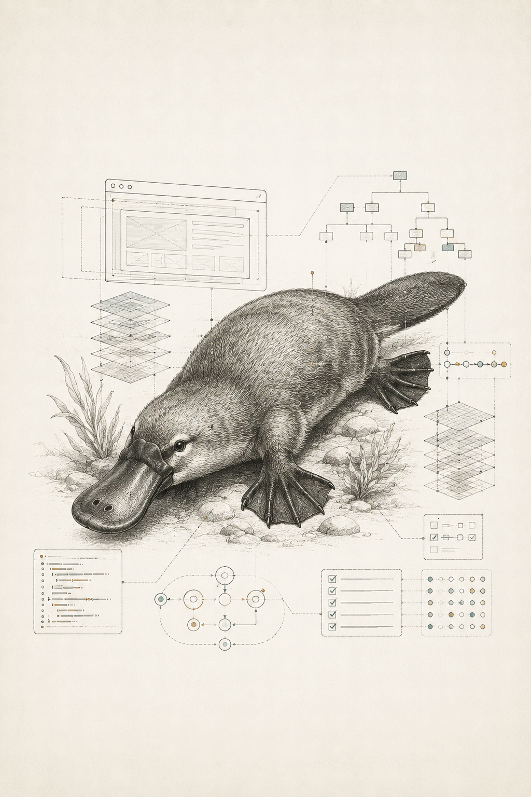

# 학습 개요

  

이 책은 AI 시대의 프론트엔드 개발자가 무엇을 준비해야 하는지 다룬다. 단순히 최신 프레임워크를 소개하거나 AI 코딩 도구 사용법을 나열하는 책이 아니다. 이 책의 관심사는 더 좁고 더 깊다. AI가 코드를 생성하는 시대에도 인간 개발자가 어떻게 시스템을 이해하고, 설계를 유지하고, 자동생성 코드에 대한 통제권을 잃지 않을 수 있는가다.

프론트엔드 개발은 이미 여러 번 중심축이 바뀌었다. jQuery와 DOM 조작 중심의 시대, SPA와 컴포넌트 중심의 시대, 서버 렌더링과 정적 생성이 다시 중요해진 시대, 그리고 지금의 AI 보조 개발 시대가 이어졌다. 하지만 모든 변화 뒤에도 브라우저는 여전히 코드를 실행하고, 네트워크는 여전히 지연되며, 상태는 여전히 꼬이고, 사용자는 여전히 깨진 화면 앞에서 기다리지 않는다.

따라서 이 책은 네 가지 층으로 구성된다.

첫째, 현재의 프론트엔드 지형을 이해한다. React, Next.js, Vue, Nuxt, Svelte, SvelteKit, Astro, Solid, Angular 같은 도구들이 어떤 문제를 해결하려고 하는지 살펴본다. 중요한 것은 어떤 프레임워크가 이기는지 맞히는 일이 아니라, 프레임워크들이 공통으로 향하는 방향을 읽는 일이다.

둘째, 변하지 않는 기본기를 복원한다. 브라우저 렌더링, 이벤트 루프, HTTP, 캐시, CORS, 쿠키, 보안, 접근성, 성능 같은 주제는 유행과 별개로 프론트엔드 개발자의 판단력을 만든다. AI가 코드를 작성해도 버그의 원인을 설명하고 고칠 책임은 여전히 개발자에게 남는다.

셋째, 복잡한 애플리케이션을 다루는 설계 감각을 익힌다. 상태를 어디에 둘지, 타입과 API 계약을 어떻게 나눌지, 디자인 패턴을 언제 도입할지 판단해야 한다. AI가 빠르게 코드를 만들수록 이런 경계가 흐려지기 쉬우므로, 설계는 더 중요한 기본기가 된다.

넷째, AI와 공생하는 작업 방식을 익힌다. AI에게 일을 맡기는 능력은 중요하지만, 더 중요한 것은 일을 작게 자르고, 결과를 읽고, 검증하고, 기존 코드베이스의 질서 안에 통합하는 능력이다. 이 책은 프롬프트 작성법만이 아니라 코드 리뷰, 테스트, 에이전트 운영, 일정 산정, 회귀 체크를 함께 다룬다.

이 책의 최종 목표는 독자가 "AI를 쓰는 프론트엔드 개발자"를 넘어 "AI가 만든 코드도 자기 코드처럼 책임질 수 있는 프론트엔드 개발자"가 되도록 돕는 것이다.

## 이 책의 독자

- AI 코딩 도구를 써보고 있지만 결과물을 완전히 신뢰하기 어려운 프론트엔드 개발자
- React나 Next.js 같은 프레임워크는 쓰지만 브라우저 내부 동작에 자신이 없는 개발자
- 큰 코드베이스를 읽고 변경하는 데 어려움을 느끼는 개발자
- 팀 차원에서 AI 생성 코드를 안전하게 도입하고 싶은 리드 개발자
- 앞으로의 프론트엔드 커리어에서 무엇을 공부해야 할지 다시 정리하고 싶은 개발자

## 이 책을 읽는 방법

이 책은 앞에서 뒤로 읽어도 좋지만, 현재 고민에 따라 다른 경로로 읽어도 된다.

AI 도구를 막 도입한 개발자라면 1-3장을 먼저 읽고, 작은 작업 하나를 작업 헌장과 검증 루프로 나누어보는 것이 좋다. 프레임워크보다 브라우저 기본기가 불안하다면 4-6장을 먼저 읽고, DevTools로 실제 화면의 렌더링과 네트워크 흐름을 확인한다. 큰 코드베이스를 다루는 일이 어렵다면 7-13장을 중심으로 상태, 타입, 코드 읽기, 리뷰, 테스트를 연결해서 읽는다. 팀에서 AI 도구를 운영하거나 일정 산정이 고민이라면 14-17장과 부록 A의 템플릿을 함께 본다.

각 Part의 마지막 장에는 실습과 회고가 있다. 이 과제들은 책을 덮기 전에 독자가 자기 코드베이스로 돌아가 한 번 더 확인하도록 설계했다. 이 책은 AI 사용법을 외우는 책이 아니라, AI가 만든 결과를 읽고 책임지는 훈련서에 가깝다.

## 이 책의 관점

AI 시대에는 코드를 빨리 쓰는 능력의 희소성이 낮아진다. 반대로 문제를 정확히 정의하는 능력, 좋은 구조와 나쁜 구조를 구분하는 능력, 실행 환경을 이해하는 능력, 코드를 읽고 검증하는 능력은 더 중요해진다.

이 책은 프론트엔드 개발자의 역할을 다음과 같이 본다.

- 구현자: 요구사항을 작동하는 UI로 바꾼다.
- 해석자: 사용자, 디자이너, 백엔드, 브라우저, AI 사이의 언어를 번역한다.
- 설계자: 시간이 지나도 변경 가능한 구조를 만든다.
- 검증자: 생성된 코드가 실제로 맞는지 확인한다.
- 운영자: 코드가 배포된 뒤에도 성능, 접근성, 보안, 유지보수를 책임진다.
- 산정자: 빠른 초안과 책임 가능한 제품 코드 사이의 불확실성을 설명한다.

## 출처

- Stack Overflow Developer Survey 2025: https://survey.stackoverflow.co/2025/
- GitHub Octoverse 2025: https://github.blog/news-insights/octoverse/octoverse-a-new-developer-joins-github-every-second-as-ai-leads-typescript-to-1/
- JetBrains State of Developer Ecosystem 2025: https://blog.jetbrains.com/en/research/2025/10/state-of-developer-ecosystem-2025/
- Agile Alliance, Estimation: https://www.agilealliance.org/glossary/estimation/
